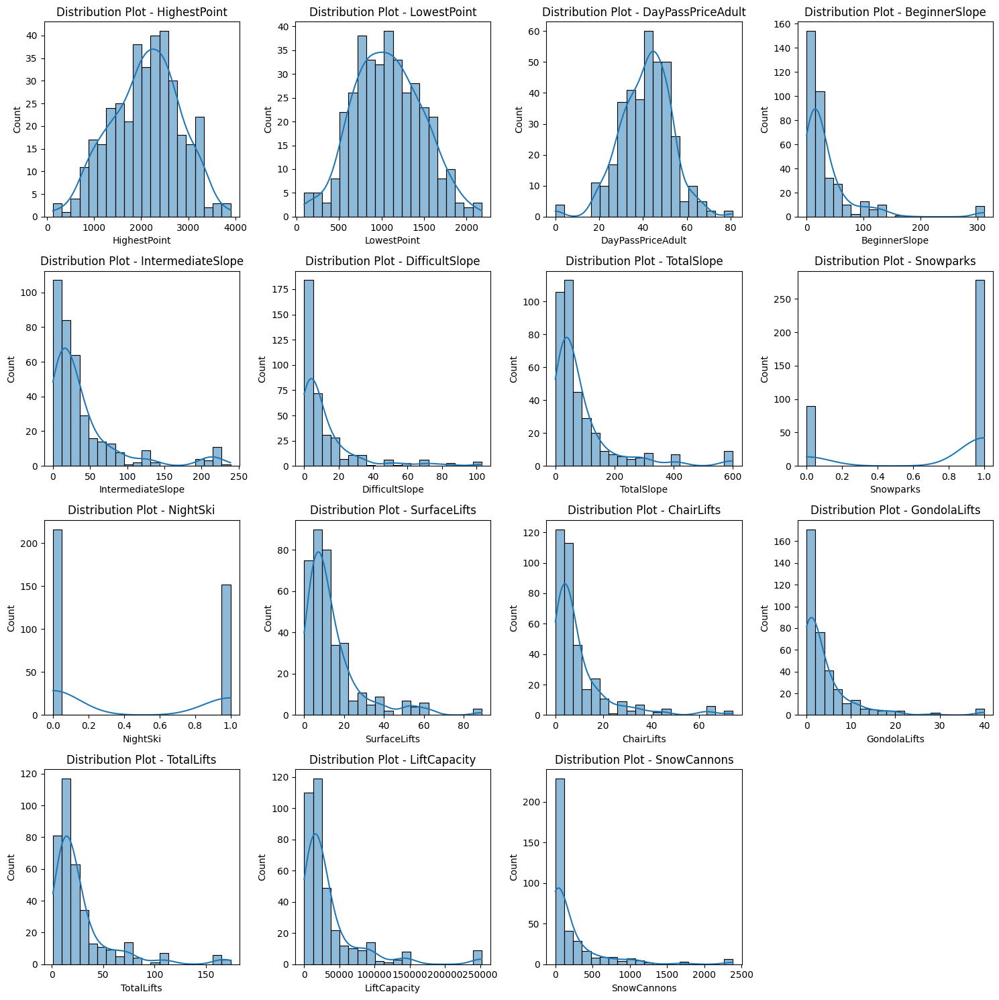
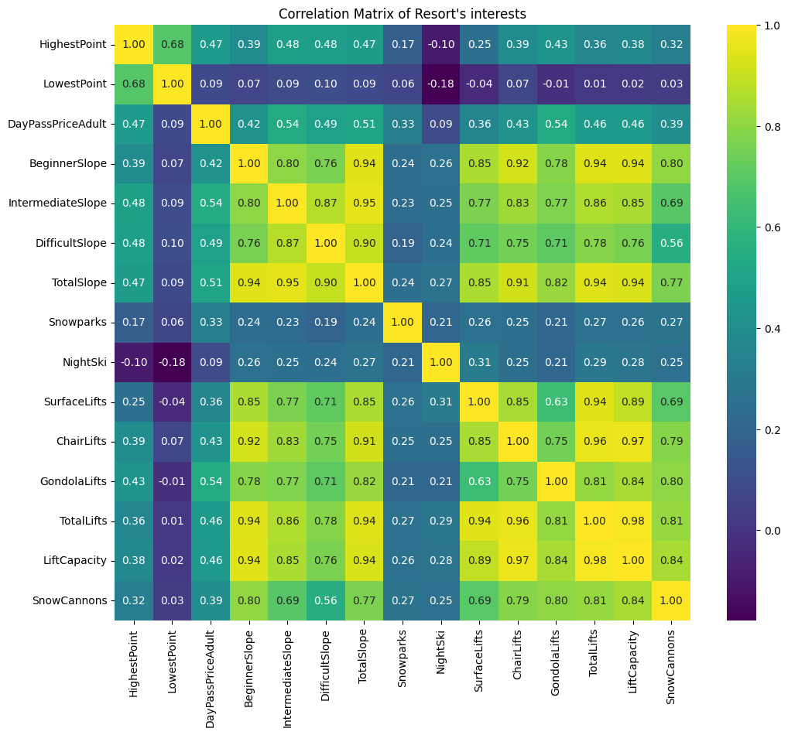

# European Ski Resort Pricing

# 1. Data
The data used in this project is from Kaggle. It contains data from ski resorts in Europe. The dataset has approximately ~370 data points.

[Kaggle Data](https://www.kaggle.com/datasets/thomasnibb/european-ski-resorts)

# 2. Method

The goal was to first explore the data to identify interesting features within the dataset.

  1. Regression models (Ridge and Lasso) - This is useful for predicting the DayPassPriceAdult which is the price of admission for an adult for a single day.

# 3. Cleaning
  1. Removed columns: "#" and "Resorts" 
  2. Converted Columns: "NightSki" and "Snowparks" to numerical values
  3. Removed "no reports" from "Snowpark"
  4. Created Scatter plots and Box Plots, highlighting the visualizations of Day Pass Price vs Total Slopes, Day Pass Price vs Difficult Slopes, Day Pass Price vs Highest Point and Day Pass Price vs Lowest Point
  5. Created a Heat Map and Distribution Plots of Resort Interests

# 4. EDA

We explored the dataset and discovered the right skewness of most of the distributions. The heatmap provided insights that the most correlated columns to the adult day pass price are the gondola lifts and intermediate slopes. We also saw that France had the most slopes.
Some of the insights we gained from our exploratory data analysis are that Switzerland has the highest costs of 81 Euros and there were 8 cheapest resorts which were 0 because they did not have day passes. While France has the highest number of slopes and lifts.

# 5. Modeling

In our modeling, we attempted to use a linear regression model. We used L1 and L2 penalty to avoid overfitting our data.
L1 (Lasso) we found to be a slightly lower MSE of 28.5 compared to the L2 (Ridge) which has a higher MSE of 29.6. In the linear regression model using a standard scaler worsened our MSE.

# 6. Further Research
Acquiring additional data on European ski resorts and exploring more advanced grouping algorithms constitutes a valuable initial step. While the existing dataset serves as a solid proof of concept and starting point, it would be intriguing to observe how it performs with larger datasets.

